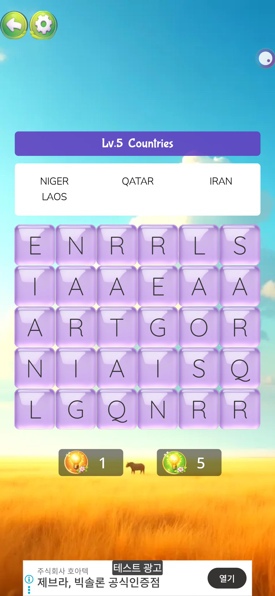
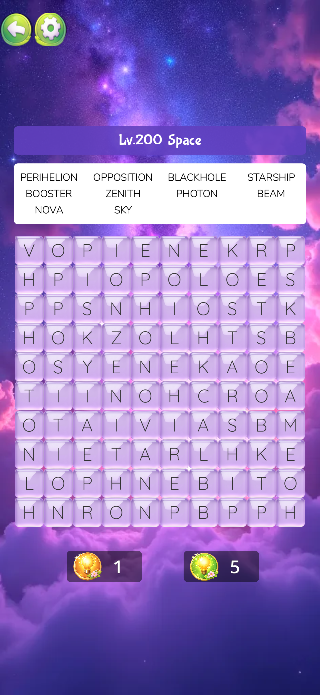

# 🌸 Word Bloom - AI-Augmented Word Puzzle Game

> **AI와 협업하여 단 2주 만에 기획부터 마켓 등록 준비까지 완료한, 상용화 수준의 고도화된 단어 퍼즐 게임 프로토타입입니다.**

---

## 📱 프로젝트 개요
- **장르**: 퍼즐 / 단어 검색 (Word Search)
- **엔진**: Godot 4.6 Stable (GDScript)
- **플랫폼**: Android, iOS (예정), Android TV / Fire TV 대응
- **개발 기간**: 2026.03.11 ~ 2026.03.20 (약 10일)
- **핵심 컨셉**: AI(Claude/GPT)를 개발 전 과정(기획, 아키텍처, 트러블슈팅)에 도입하여 생산성을 극대화한 '바이브 코딩(Vibe Coding)'의 실전 사례

---

## 🎨 시각적 결과물
| 홈 화면 | 게임 플레이 | 난이도 증가(Lv.200) |
| :---: | :---: | :---: |
|  |  |  |

---

## 🚀 주요 기능 및 기술적 강점

### 1. AI 기반의 초고속 개발 프로세스
- **기획서 27종 자동 생성 및 구현**: Claude를 활용해 게임 아키텍처, 광고 정책, 리텐션 로직을 정교하게 설계하고 이를 GDScript로 즉시 변환.
- **아키텍처 설계**: Singleton(Autoload) 패턴을 활용한 `GameManager`, `AdManager`, `SaveManager` 등 체계적인 모듈화.

### 2. 수익화 및 리텐션 시스템
- **AdMob 통합**: 배너, 전면, 보상형 광고를 유저 경험을 저해하지 않는 수준(Lv.5+)에서 유연하게 배치.
- **7일 연속 출석 스트릭**: 유저 리텐션을 위한 정교한 보상 밸런싱 및 데이터 보존 시스템.
- **인앱 결제(IAP)**: '광고 제거' 기능 등 상용 게임에 필수적인 수익화 로직 구현.

### 3. 멀티 플랫폼 및 반응형 레이아웃
- **TV Lean-back UI**: 모바일 터치뿐만 아니라 D-pad(Android TV/Fire TV) 입력을 고려한 네비게이션 및 포커스 시스템 구축.
- **반응형 그리드**: 화면 크기에 따라 단어 그리드와 UI 배치가 자동으로 최적화되는 동적 레이아웃 엔진.

### 4. 기술적 문제 해결 사례 (Troubleshooting)
- **레이아웃 타이밍 이슈**: `_ready()` 시점의 노드 크기 미확정 문제를 `call_deferred`와 시그널 기반 초기화로 해결.
- **AI 협업 최적화**: AI가 생성한 코드의 3.x/4.x 문법 혼용 문제를 프롬프트 튜닝과 직접 리팩토링으로 극복.

---

## 🛠 Tech Stack
- **Engine**: Godot 4.6 (Stable)
- **Language**: GDScript
- **Design Tools**: ComfyUI (Workflows 포함), AI Generated Assets
- **AI Collaboration**: Claude 3.5 Sonnet, GPT-5.4 (Vibe Coding Methodology)
- **Version Control**: Git

---

## 📂 프로젝트 구조
- `/Puzzle`: Godot 프로젝트 소스 코드
- `/기획서`: AI와 협업하여 도출한 27종의 상세 기획 문서
- `/screenshots`: 실제 구동 화면 이미지
- `/word-bloom-policy`: 개인정보처리방침 등 스토어 등록용 법적 문서

---

## 📧 Contact
- **Developer**: KIM MIN GWAN
- **Email**: mingwan1492@gmail.com
- **GitHub**: [github.com/aile1492](https://github.com/aile1492)
