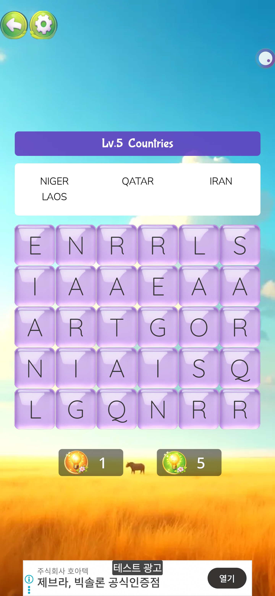
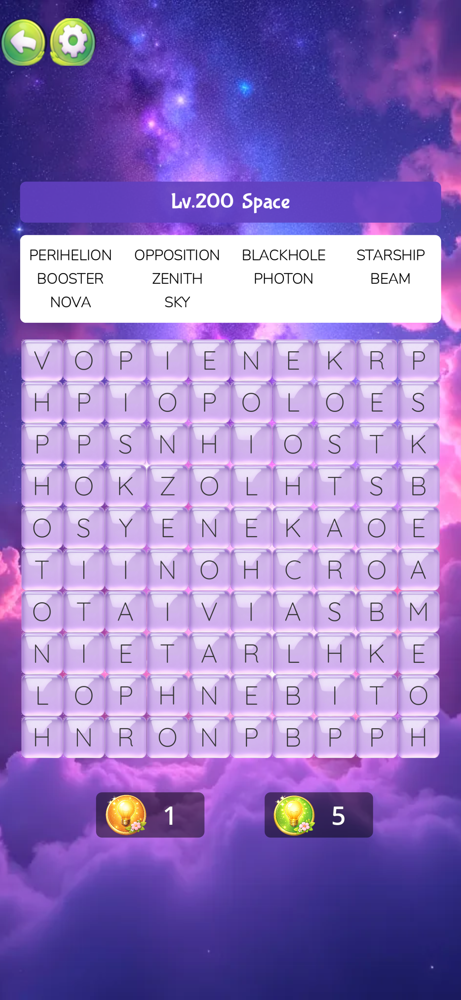

# Word Bloom

AI와 협업해 기획부터 구현, 이미지 제작, Android 빌드와 Google Play 출시까지 진행한 1인 개발 단어 퍼즐 게임입니다.

단순히 기능을 빠르게 만드는 데 그치지 않고, AI가 제안한 내용은 직접 검토하고 실제 기기에서 확인하며 게임으로 완성하는 과정에 집중했습니다.

**[Google Play에서 보기](https://play.google.com/store/apps/details?id=com.wordbloom.game)** · **[전체 포트폴리오](https://app.notion.com/p/33413eca6587815c98e5da909b315272)**

## 프로젝트 개요

- 장르: 단어 찾기 퍼즐
- 엔진: Godot 4.6
- 언어: GDScript
- 주요 플랫폼: Android
- 초기 플레이 가능 버전 개발: 2026년 3월 11일~20일, 약 10일
- 담당 범위: 기획, 프로그래밍, 화면 구성, 이미지 제작, 빌드, 스토어 등록과 출시

## 게임 화면

| 홈 화면 | 게임 진행 | 높은 단계의 퍼즐 |
| :---: | :---: | :---: |
|  |  |  |

## 주요 기능

- 글자판에서 단어를 찾는 단계형 퍼즐
- 진행 상황과 설정을 보존하는 저장 기능
- 모바일 화면 크기에 맞춰 배치가 달라지는 반응형 화면 구성
- 연속 출석 보상과 힌트 등 반복 플레이를 돕는 기능
- AdMob 광고와 광고 제거용 인앱 결제 기능
- 터치 입력을 중심으로 구성한 Android 조작 방식

## AI와 협업한 방식

- 기획 초안과 기능 목록을 정리하고 구현 범위를 나눴습니다.
- 코드 초안과 문제 해결 방법을 제안받은 뒤, Godot 4 문법과 프로젝트 구조에 맞게 직접 수정했습니다.
- AI가 만든 코드의 버전 차이와 잘못된 가정을 실제 실행 결과를 기준으로 확인했습니다.
- ComfyUI로 이미지 제작 과정을 구성하고, 결과물을 게임 화면에 맞게 선별·수정했습니다.

AI는 개발 속도를 높이는 도구로 사용했고, 기능 선택과 구조 설계, 최종 검증은 직접 수행했습니다.

## 구현 과정에서 해결한 문제

### 화면 배치 초기화 시점

`_ready()`가 호출될 때 일부 화면 요소의 크기가 아직 정해지지 않아 배치가 어긋나는 문제가 있었습니다. `call_deferred`와 신호 기반 초기화를 적용해 실제 크기가 결정된 뒤 화면을 구성하도록 수정했습니다.

### Godot 버전이 다른 코드 제안

AI가 Godot 3과 Godot 4 문법을 섞어 제안하는 경우가 있었습니다. 공식 문서와 실행 오류를 기준으로 코드를 검토하고, 현재 프로젝트에 맞는 GDScript로 다시 작성했습니다.

### 출시 준비

게임 기능뿐 아니라 Android 빌드 설정, 스토어용 이미지, 개인정보처리방침과 결제·광고 관련 구성을 함께 정리했습니다. 저장소에는 출시 과정에서 사용한 이미지와 문서도 포함되어 있습니다.

## 사용 기술

- Godot 4.6
- GDScript
- AdMob
- Google Play Billing
- ComfyUI
- Git, GitHub
- Claude, GPT

## 저장소 구성

- `src/word-puzzle`: Godot 프로젝트 소스 코드
- `docs`: 기획과 개발 문서
- `screenshots`: 실제 실행 화면
- `build_config/store_assets`: 스토어 등록용 이미지
- `comfyui_workflows`: 이미지 제작에 사용한 ComfyUI 작업 흐름
- `word-bloom-policy`: 개인정보처리방침

## 개발자

- KIM MIN GWAN
- mingwan1492@gmail.com
- [GitHub 프로필](https://github.com/aile1492)
